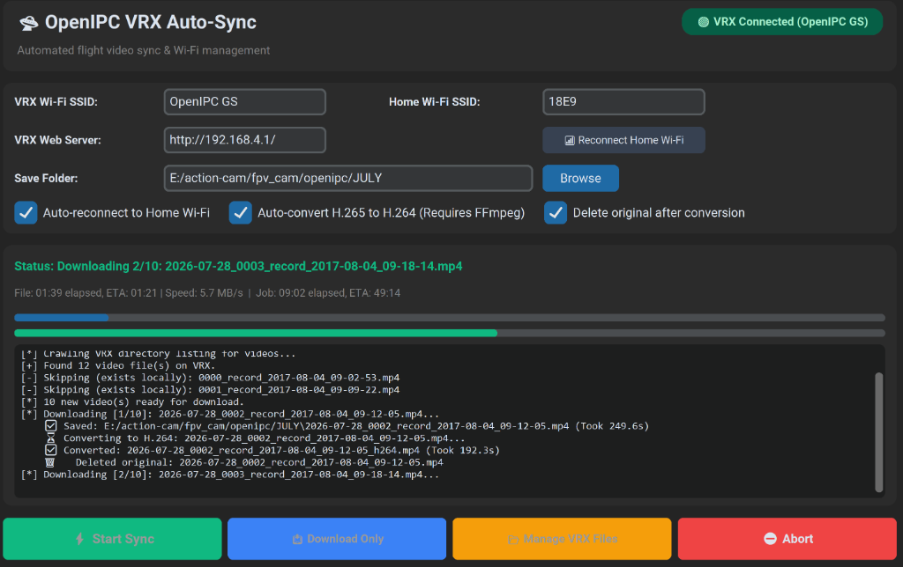

# 🛸 OpenIPC VRX Auto-Sync & Downloader

A cross-platform GUI tool designed to automate downloading, organizing, and converting flight footage from your OpenIPC VRX (Video Receiver).



---

### 💡 Why is this useful?
As an FPV pilot using an OpenIPC digital video system, getting your flight footage off your VRX usually involves a tedious manual process: you have to disconnect your PC from your home Wi-Fi, connect to the VRX's hotspot, open a web browser to `192.168.4.1`, manually download each video file one by one (trying to remember which ones you already downloaded), and then reconnect to your home network.

**This tool completely automates that workflow.** With a single click, it will:
1. Automatically switch your PC's Wi-Fi over to your VRX.
2. Scan the VRX web server for new flight videos.
3. Compare the files against your local save folder and internal sync ledger to skip any you've already downloaded.
4. Prefix new footage with today's date for clean file organization.
5. Download all new videos automatically.
6. Optionally convert H.265 files to H.264 on the fly for immediate editing.
7. Reconnect your PC back to your home Wi-Fi when finished!

---

## ✨ Key Features
- 🖥️ **Modern Dark-Mode GUI** — A sleek, responsive interface built with CustomTkinter.
- 📶 **Auto Wi-Fi Switching** — Automatically connects to your VRX, downloads videos, and reconnects to your Home Wi-Fi when done.
- 🔴/🟢 **Live Connection Status** — Real-time indicator for your VRX connection status.
- ⏱️ **Live ETAs & Speeds** — See real-time download speeds, elapsed time, and ETAs for both the current file and the overall job.
- 📥 **Smart Downloads & Sync History** — Skips videos you've already downloaded using an internal `.sync_history.json` ledger and smart file size checking.
- 📅 **Automatic Date Prefixing** — Automatically prefixes downloaded footage with today's date (e.g., `2026-07-28_0005...mp4`) so you can easily organize flights even if the VRX internal clock reset to 2017.
- 📂 **Visual VRX File Manager** — Interactive popup window to view all videos on your VRX SD card, see file sizes in MB, check download status (`✅ Saved` vs `⚠️ NOT DOWNLOADED`), and selectively delete files with safety warnings.
- 🎬 **H.264 Auto-Conversion** — Optionally converts H.265 videos to H.264 on the fly using FFmpeg for easier editing and playback.
- 🗑️ **Auto-Cleanup** — Option to automatically delete the original H.265 file after a successful conversion.
- 🌍 **Cross-Platform** — Works flawlessly on Windows, macOS, and Linux.
- 🔔 **Native Notifications** — Get desktop alerts when downloads finish.

---

## 🕹️ Button Guide (Which button should I click?)

The app provides three main action buttons at the bottom of the interface. Here is exactly when and why to use each one:

| Button | What it does | When to use it |
| :--- | :--- | :--- |
| **`⚡ Start Sync`** | **Full Automated Workflow:** Automatically disconnects from your home Wi-Fi, connects to your VRX hotspot, downloads all new videos, converts them (if enabled), and **automatically reconnects you back to your Home Wi-Fi** when finished. | Use this as your primary button when sitting at your desk on your home network after a flight session! |
| **`📥 Download Only`** | **Skip Wi-Fi Switching:** Jumps straight into scanning the VRX and downloading videos immediately without changing your PC's Wi-Fi network. It will not reconnect to home Wi-Fi when done. | Use this if your PC is **already connected** to the VRX hotspot manually, or if you are wired via Ethernet/Hotspot and don't want the app changing your network settings. |
| **`📂 Manage VRX Files`** | **Interactive SD Card Cleaner:** Opens a visual popup window showing all videos on the VRX SD card, their exact size in MB, and whether they have been saved to your PC (`✅ Saved` vs `⚠️ NOT DOWNLOADED`). Allows selective or bulk deletion with built-in safety warnings. | Use this when you want to free up space on your SD card. *Note: If you are not connected to the VRX, it will automatically switch your Wi-Fi over to scan the card!* |

---

## 📋 Requirements & Setup
- **Python 3.8+**
- **CustomTkinter** (UI Library)
- **FFmpeg** *(Optional — only required if using the H.264 auto-conversion feature)*

### 1. Library Installation

**Windows**
1. Ensure you have Python installed from [python.org](https://www.python.org/downloads/) or via the Microsoft Store.
2. Open Command Prompt or PowerShell and install CustomTkinter:
   ```cmd
   pip install customtkinter
   ```

**Linux & macOS**
1. Make sure Python 3 and pip are installed.
2. Install the required dependency:
   ```bash
   pip3 install customtkinter
   ```

### 2. Installing FFmpeg (Optional)
If you want to use the **H.264 Auto-Conversion** feature, you need `ffmpeg` available on your system.

**Windows (Easiest Method)**
Simply download an official `ffmpeg.exe` binary and place it directly inside this `openipc_downloader` folder (right next to `openipc_downloader.py`). The app will automatically detect and use it!

**Windows (System PATH / Advanced)**
```powershell
# Using winget (Windows 10/11)
winget install ffmpeg

# Or using Chocolatey
choco install ffmpeg
```

**macOS & Linux**
```bash
# macOS
brew install ffmpeg

# Linux (Ubuntu/Debian)
sudo apt update && sudo apt install ffmpeg
```

---

## 🚀 Usage

> ⚠️ **Important:** Before running the tool, make sure your VRX is powered on and its **Wi-Fi Hotspot feature is activated** so your PC can connect to it!
> 
> 💡 **First Time Setup:** You **MUST** connect your PC to the VRX Wi-Fi network manually at least once! The tool relies on your operating system (Windows/macOS/Linux) having the Wi-Fi password saved as a known network.

### Launching the App
- **Windows (Easiest):** Simply double-click the **`run_downloader.bat`** file to launch the app!
- **Linux & macOS:** Run the Python script directly from your terminal:
  ```bash
  python3 openipc_downloader.py
  ```

### Step-by-Step Workflow
1. **VRX Wi-Fi SSID:** Enter the exact Wi-Fi name of your VRX hotspot (e.g., `OpenIPC GS`).
2. **Home Wi-Fi SSID:** Enter your home internet Wi-Fi name (so the tool can automatically reconnect you when finished).
3. **Save Folder:** Choose or browse where you want your flight videos saved on your PC.
4. **Choose Your Action:**
   - Click **`⚡ Start Sync`** to let the app handle switching Wi-Fi, downloading, converting, and reconnecting automatically.
   - Click **`📥 Download Only`** if you are already connected to the VRX network.
   - Click **`📂 Manage VRX Files`** to open the visual cleaner, verify which videos are safely backed up (`✅ Saved`), and delete old footage from your SD card.

---

## 📄 License
This project is licensed under the MIT License - see the [LICENSE](LICENSE) file for details.
